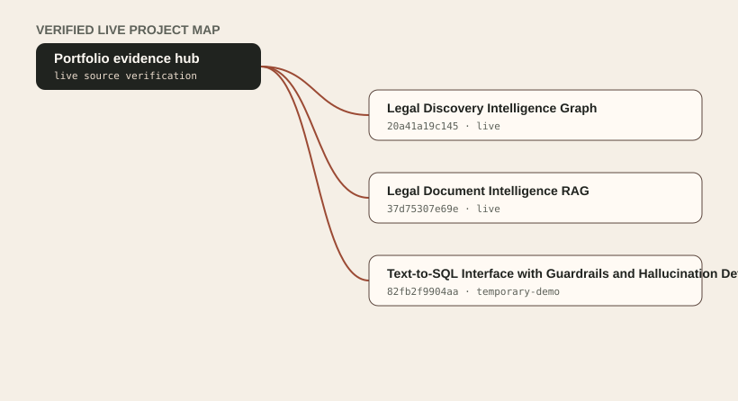

# Vaibhav Khurana — AI Engineering Portfolio

A professional portfolio for production-shaped AI systems, retrieval applications, agents, analytics, and data platforms. Public projects are admitted automatically only when an enabled release contract and anonymous live endpoint verify the exact current source revision.

## Approved projects

<!-- approved-projects:start -->

Generated from the verified live catalog. Project rows are not edited by hand.

| Project | Focus | Deployment | Evidence | Source |
| --- | --- | --- | --- | --- |
| [Legal Discovery Intelligence Graph](https://github.com/vaibhavkhuranaaa/legal-discovery-intelligence-graph) | A deployed Graph RAG investigation workspace with cited evidence, entity graphs, and reproducible evaluation. | live | Entity-mention extraction achieved micro F1 0.887 strict on the committed synthetic corpus.; Hybrid retrieval achieved R@10 0.857 and graph expansion improved relationship hit@5 to 0.833.; Privilege and synthetic-PII rules achieved F1 1.0 on clean templated text. | `20a41a19c145e118a4aea3b7dba5256274bf0714` |
| [Legal Document Intelligence RAG](https://github.com/vaibhavkhuranaaa/legal-document-intelligence-rag) | A deployed Azure RAG research workspace for citation-grounded questions over public M&A litigation and transaction documents. | live | The 45-question release benchmark recorded retrieval hit rate@8 1.0 and citation-provenance validity 1.0.; The current Azure App Service application root returned HTTP 200.; The deployed retrieval corpus is derived from registered public court and SEC sources, not confidential client documents. | `639fd8a54f45f24059ccd3acc1ba56d1767962c9` |
| [Text-to-SQL Interface with Guardrails and Hallucination Detection](https://github.com/vaibhavkhuranaaa/text-to-sql-guardrails) | An approval-gated analyst console that turns bounded natural-language questions into policy-checked, read-only SQL over disclosed synthetic data. | temporary-demo | All 18 deterministic policy cases matched their expected trusted or refused outcomes.; Six status-only public route, fixture-boundary, and deployed-control checks passed for the anonymous temporary demo.; The active public revision reports the committed demo fixture, not the local approved snapshot. | `82fb2f9904aa9ec220b70598b4c9a74c7e72bcd9` |

<!-- approved-projects:end -->

## Approved project map

[](https://portfolio-reeper1.vercel.app/work)

The static map renders directly on GitHub. Open it to explore the corresponding live project pages and evidence.

## Run locally

```bash
npm install
npm run sync-projects
npm run dev
```

Open `http://localhost:3000`.

`sync-projects` fetches verified live project manifests pinned to exact commits in `scripts/project-registry.mjs`. External manifests must exist before normal local development or deployment. For an offline preview using the checked-in validation fixtures:

```bash
PROJECT_MANIFEST_SOURCE_DIR=tests/fixtures/manifests npm run sync-projects
npm run dev
```

## Configure before publishing

- Copy `.env.example` to `.env.local` and set the public site URL and contact email. Production deployment rejects placeholder values.
- Add validated `portfolio/project.json` and `portfolio/release.json` files to the project repository.
- Set `status` to `enabled` and `publicProject` to `true` only for a project intended for automatic public admission.
- Expose an anonymous JSON verification endpoint whose configured field reports the deployed source SHA.
- Keep confidential material generalized, and label any recorded or simulated demo clearly.

## Quality checks

```bash
npm run lint
npm run build
npm test
```

The application has static project pages, `sitemap.xml`, `robots.txt`, a generated Open Graph image, and verified-only portfolio/résumé/index projection payloads. See `docs/project-release-workflow.md` for the automatic live-SHA release path.
